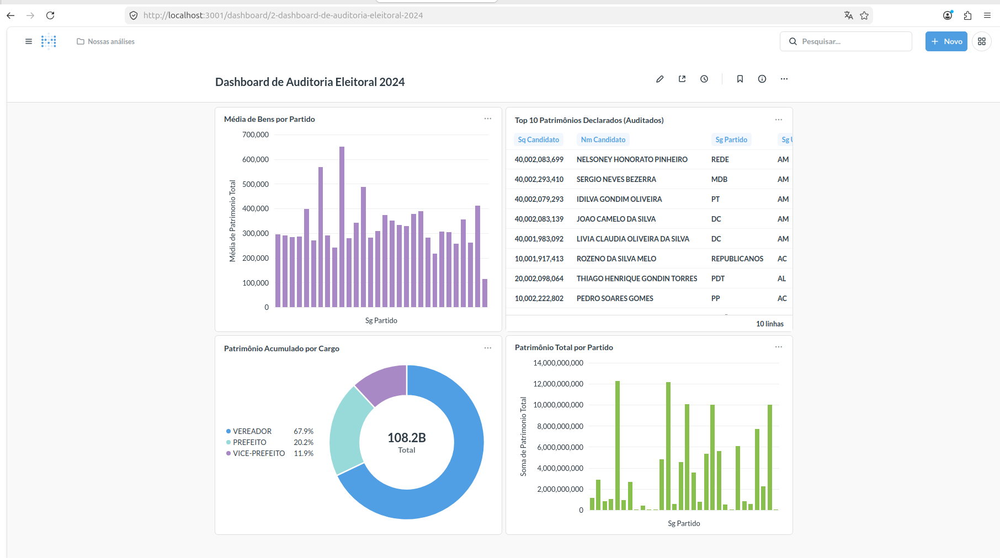

# 🗳️ Observatório de Dados Eleitorais: Auditoria de Patrimônio (Eleições 2024)


## 🎯 Objetivo
Desenvolver um ecossistema de dados automatizado para identificar disparidades patrimoniais em candidatos do pleito de 2024. O pipeline processa quase **1 milhão de registros de bens** para sinalizar perfis com patrimônio superior a **R$ 10 milhões** e isolar anomalias de preenchimento que distorcem a realidade estatística.

## 📊 Origem dos Dados
Os dados utilizados são públicos, extraídos do **Portal de Dados Abertos do TSE**, referentes aos candidatos e bens declarados nas Eleições Municipais de 2024.

## 🛠️ Stack Tecnológica
- **SO:** Linux Ubuntu 24.04 (Estação Vaio)
- **Infraestrutura:** Docker & Docker Compose (Isolamento de serviços).
- **Banco de Dados:** PostgreSQL 15 (Arquitetura Medalhão: Bronze, Silver, Gold).
- **Linguagem:** Python 3.12 (Pandas para ETL, SQLAlchemy para persistência).
- **BI & Visualização:** Metabase (Dashboarding e Data Discovery).
- **Acesso Remoto:** ngrok (Exposição segura via túnel HTTP).

---

## 🏗️ Arquitetura do Pipeline (Medallion Architecture)
O projeto garante a linhagem e qualidade do dado através de três camadas lógicas:
1.  **Bronze (Raw):** Ingestão direta dos arquivos CSV do TSE via `scripts/ingestao_bronze.py`.
2.  **Silver (Cleaned):** Processamento via `scripts/processamento_silver.py`. Normalização de esquemas e limpeza monetária.
3.  **Gold (Curated):** Consolidação final via `scripts/gerar_camada_gold.py`. Bifurcação entre Ranking Patrimonial e Log de Anomalias.

---

## 🛡️ Qualidade e Resiliência (Data Quality & Disaster Recovery)

### Filtro de Integridade
Identificação de erros de preenchimento na fonte (ex: patrimônios bilionários por erro de digitação). 
- **Regra de Negócio:** Candidatos com soma de bens > **R$ 500 milhões** são movidos para `gold.log_anomalias_tse`, protegendo a fidedignidade das médias estatísticas.

### Garantia de Resiliência (Restore Test)
Implementação de uma rotina automática para garantir que os dados sejam 100% recuperáveis:
1. **Backup:** Script `scripts/backup_db.sh` gera dumps SQL completos (~685MB).
2. **Validação:** Script `scripts/validate_backup.py` instancia um banco temporário no Docker e audita a volumetria da camada **GOLD**.

**Comando de Auditoria:**
```
sudo bash scripts/backup_db.sh && sudo python3 scripts/validate_backup.py
```


---

## 📈 Resultados da Auditoria (Dados Consolidados)
* **Total de registros de bens processados:** ~912.620
* **Candidatos únicos na Camada Gold:** 296.071
* **Candidatos sinalizados (> R$ 10M):** 622
* **Anomalias Detectadas:** 13 casos isolados tratados via regra de negócio.
* **Integridade de Backup:** 100% validado via script de auditoria.

---

## 🚀 Como Reproduzir
Para executar este projeto localmente, siga os passos:

1. **Inicie a Infraestrutura:**
```
sudo docker compose up -d
```

### 2. Configure o Ambiente Python

# Criar e ativar o ambiente virtual
```
python3 -m venv venv
source venv/bin/activate
```

# Instalar dependências
```
pip install -r requirements.txt
```

### 3. Execute o Pipeline
```
python3 scripts/ingestao_bronze.py
python3 scripts/processamento_silver.py
python3 scripts/gerar_camada_gold.py
```


## 📚 Manual de Comandos Rápidos

| Ação | Comando |
| :--- | :--- |
| **Gerar Backup** | `sudo docker exec pg_eleicoes pg_dump -U admin db_eleicoes > backup.sql` |
| **Limpar e Reiniciar Banco** | `sudo docker compose down -v && sudo docker compose up -d` |
| **Auditoria Direta (psql)** | `sudo docker exec pg_eleicoes psql -U admin -d db_eleicoes -c "SELECT * FROM gold.ranking_patrimonial LIMIT 5;"` |
| **Forçar Drop Banco** | `sudo docker exec pg_eleicoes psql -U admin -d postgres -c "DROP DATABASE nome_db WITH (FORCE);"` |


---
## 👤 Autor
**Otoniel Nunes**
* [LinkedIn](https://www.linkedin.com/in/otoniel-lima)
* [Portfólio/GitHub](https://github.com/otolima/observatorio_eleitoral)